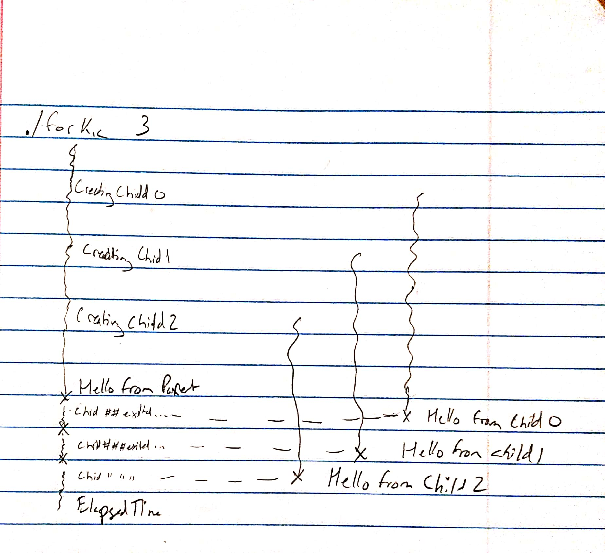

# Exercise 12
## Threads

Reading: Chapter 9 of *Think OS* and Chapter 12 of *Head First C*.

### counter.c

1) In this directory you should find `counter.c`, a program that runs
multiple threads that increment a counter.  Read through the code and
make sure you understand it.

One of the functions in `counter.c` is `make_thread`, which
creates a new child thread.  One of its parameters, `entry`, is
a pointer to a function, so the syntax is a little complicated:

 ```C
    pthread_t make_thread(void *(*entry)(void *), Shared *shared)
    {
        int ret;
        pthread_t thread;

        ret = pthread_create (&thread, NULL, entry, (void *) shared);
        if (ret != 0) perror_exit ("pthread_create failed");
        return thread;
    }
 ```

If you are not sure about this type declaration, you can use
[cdecl.org](http://cdecl.org) to interpret it.


2) Use the Makefile to compile `counter.c` and run it.  Draw a thread
diagram that shows the interactions of the parent thread and the children.
Is the final value of the counter correct?



The final value of counter always matches NUM_CHILDREN in the end. I am unsure as to why. The program does not appear to be threadsafe.

3) Increase the number of children, then compile and run the program again.
Do you see evidence that the threads are running concurrently?  Do any
synchronization errors occur?
As the NUM_CHILDREN variable is increased the evidence of concurrent threads begins to decrease. With few exceptions the output matches the value of in the make_thread loop.

### counter_array.c

1) In this directory you should find `counter_array.c`, which is similar
to `counter`, but it uses an array to simulate a shared work queue.

The idea is that each element of the array represents a unit of work.
We want to run multiple threads to do the work, but we have to make sure
each unit of work gets done exactly once.

So we use a counter to keep track of the next unallocated unit of
work.  Each thread should check the counter to see which unit to
work on, do the work, and then increment one element of the array
to indicate that the unit is done.

If everything works correctly, each element of the array should be
incremented exactly once.  If there are synchronization errors, some
elements might be 0, or greater than 1.

Again, read through the program to be sure you understand it.

2) Use the Makefile to compile the program and run it.  Do any
syncronization errors occur?

3) Also in this directory you should fine `mutex.c` and `mutex.h`, which
contain wrappers for the `pthread_mutex_t` structure provided by pthreads,
with a more object-oriented interface.

Make a copy of `counter_array.c` called `counter_array_mutex.c` and
add code that uses a `Mutex` to eliminate the synchronization errors.

Compile, run, and confirm that there are no errors now.
There are none

4) Synchronization takes some time.  Comment out the print statements
in `counter_array.c` and `counter_array_mutex.c`, then recompile and time them.

```
    time ./counter_array
    time ./counter_array_mutex
```

How much overhead does the synchronization impose?
The mutex imposes some pretty hefty overhead. The process takes 10x as long at the real time. At the level of the system, the process takes nearly 50x as long or even longer in some cases.
